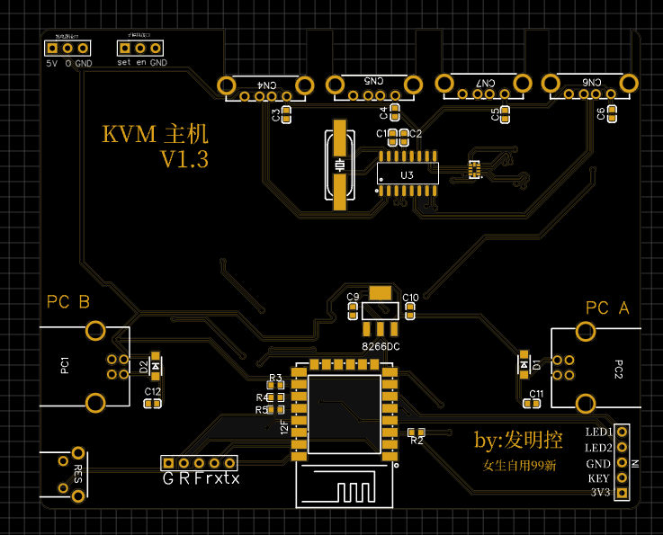
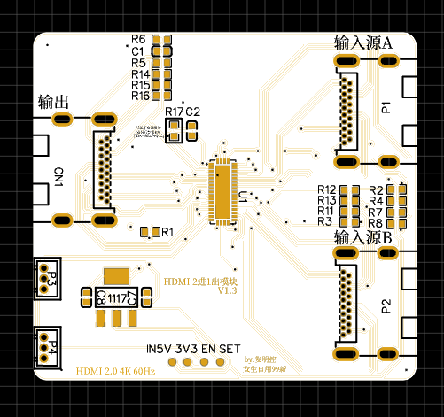
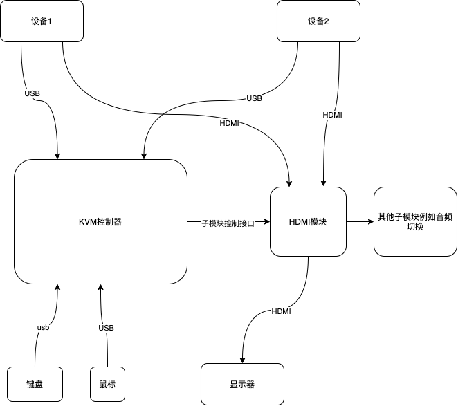

# KVM
开源 双/多 平台KVM切换器 

## 视频：

## 原理图和PCB工程：

## 方案设计
* USB开关芯片：TS3USB221
* USB HUB芯片 ：SL2.1A
* 视频切换开关芯片：TS3DV642
* 逻辑网络控制：ESP12—F
### 目前模块：
#### 主机模块 

#### HDMI 模块

### 项目框图

### API相关 （http get请求）
* 请求成功以下api均返回 “ojbk”
* 开机 http://xxx.xxx.xxx.xxx/in?in=on
* 关机 http://xxx.xxx.xxx.xxx/in?in=off
* 切换设备1 http://xxx.xxx.xxx.xxx/in?in=1
* 切换设备2 http://xxx.xxx.xxx.xxx/in?in=2  
（xxx.xxx.xxx.xxx表示设备IP地址）
### 面板切换逻辑：
* 轻触切换设备
* 长按休眠
* 休眠模式 继电器控制口输出低电平

### 上位机
* 目前仅支持win和mac
* 需要python3环境
需要的裤：  
pip install pillow  
pip install pyscreenshot  
pip install Flask  
* 运行 python3 app.py 
* mac需要给录制权限 win需要允许防火墙访问
* 在kvm设置中设置流 

## Q&A
#### 这套设备大概造价多少钱？
* 成本大致在80-100 块钱主要是使用 ti的TS3DV642 高速开关 这个芯片比较贵 不同于市面上的二三十块钱的切换设备 那种设备使用的是 两颗usb3.0开关芯片 带宽和稳定性都有待考究 不过造价便宜 后期可以会出一版这种廉价方案的扩展模块
#### 为什么没有主机的外壳文件
* 因为我我主机有好几代的版本 最新的版本 我并没建模 所以 有谁建模我可以合并到本项目
#### 我开发了一些扩展性更强的模块 我是否可以加入此项目中
* 非常欢迎 
#### 我的模块为什么没有输出
* 这种高速开关芯片是很脆弱的 更不要贪便宜 去买低价的 目前开源的都是经过测试的 如果修改 可能会造成一些问题

